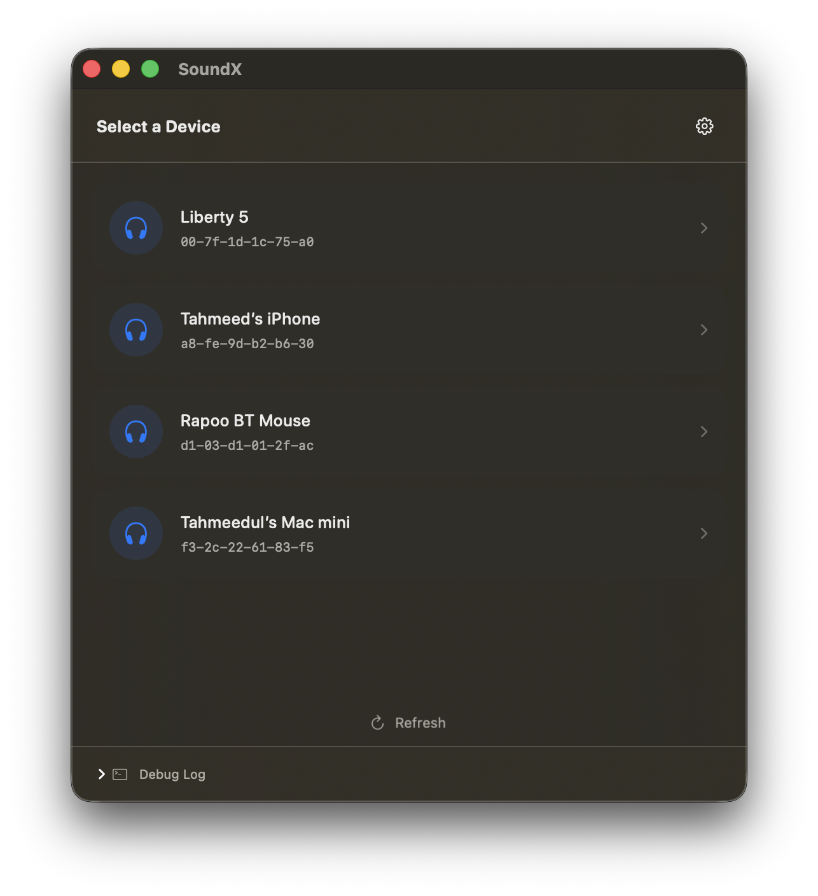
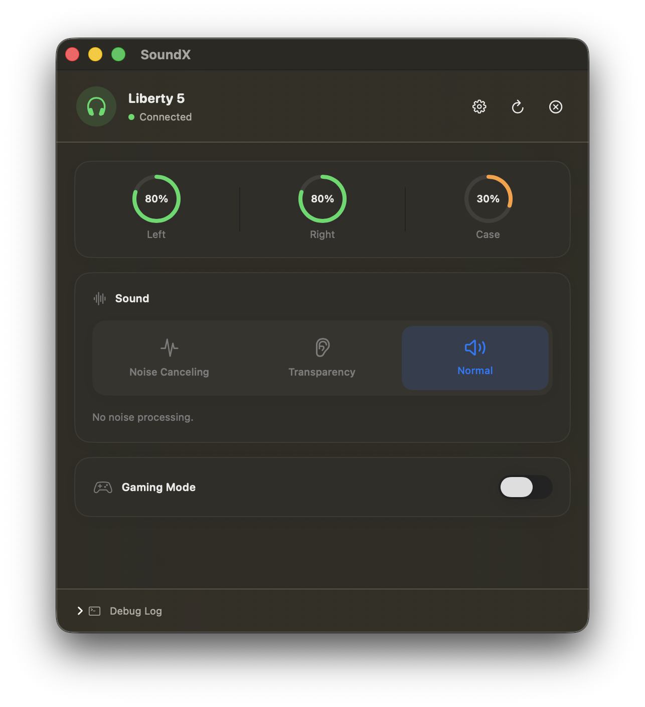
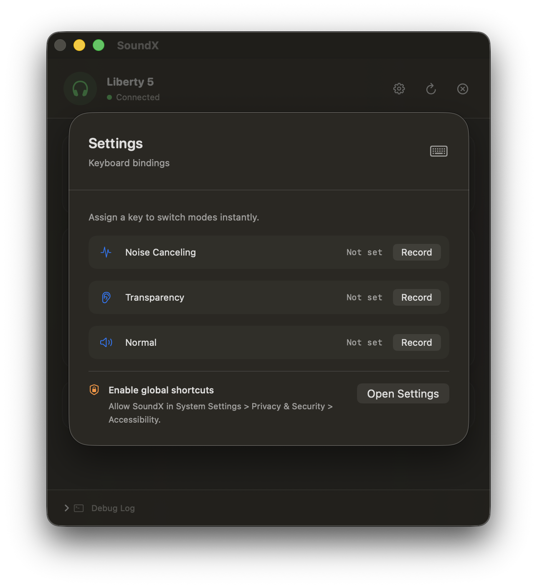

<p align="center">
  
</p>

# SoundX

SoundX is a free, open-source macOS app for controlling Soundcore true wireless earbuds. It connects directly to your earbuds over classic Bluetooth (RFCOMM) and gives you native, real-time control over noise cancellation, gaming mode, keyboard bindings and battery status.

## Screenshots

<p align="center">
  
  
  
</p>

## Features

- **Battery Percentages** — View live battery levels for the left earbud, right earbud, and charging case.
- **Switch Modes** — Toggle between Noise Cancelling, Transparency, and Normal sound modes with a single click.
- **Set Noise Cancellation Level (1-5)** — Fine-tune the strength of manual noise cancellation to match your environment.
- **Switch Gaming Mode** — Enable low-latency gaming mode for a tighter audio-visual sync in games.
- **Global Keyboard Bindings** — Change sound modes and noise cancellation levels from anywhere on macOS using customizable keyboard shortcuts, without switching to the app.

## How to Use

1. Download the latest release from the [Releases](../../releases) page (`Release/SoundX.app`).
2. Move `SoundX.app` to your `Applications` folder and open it.
3. Since the app is not notarized through the Mac App Store, macOS will block it on first launch. Go to **System Settings > Privacy & Security**, scroll down, and click **Open Anyway** next to the SoundX notice.
4. Open SoundX again and confirm you want to launch it.
5. Make sure your earbuds are paired with your Mac via **System Settings > Bluetooth** before opening the app.
6. Grant Bluetooth access when prompted, select your earbuds from the device list inside SoundX, and connect.
7. If you'd like to use global keyboard shortcuts, go to **System Settings > Privacy & Security > Accessibility** and enable SoundX. This permission is required for the app to listen for keyboard shortcuts outside its own window.

## Supported Devices

SoundX currently supports the **Soundcore Liberty 5 (model A3957)** only. The Bluetooth
packet protocol differs per device model, so the app is not yet generalized to work with
other Soundcore earbuds out of the box.

## Adding Support for a New Device

SoundX's outer Bluetooth packet framing (direction bytes, length field, checksum) is shared
across all Soundcore devices, but the internal state-packet layout, byte offsets, and
available commands differ per model. Adding a new device involves two parts:

1. **Find the protocol for the target device.** The [OpenSCQ30](https://github.com/Oppzippy/OpenSCQ30)
   project has independently reverse-engineered and documented the packet format for a wide
   range of Soundcore models. For a given model, the relevant files live under
   `lib/src/devices/soundcore/<model>/` in that repository:
   - `packets/inbound/state_update.rs` — field offsets and the state packet's byte layout
   - `packets/outbound.rs` — command bytes for each supported action
   - `modules/*.rs` — which commands are shared across devices versus overridden for that
     specific model (important: some devices use different command bytes for the same
     feature, so this step matters and should not be skipped or assumed)

2. **Implement the device in SoundX.** Define a new state struct and parser (following the
   pattern used for `A3957State` in `BluetoothManager.swift`), along with any
   device-specific command builders. Longer term, the cleanest path is to factor the current
   hardcoded A3957 logic behind a `DeviceProfile` abstraction (state parsing, command
   builders, and a `supportedFeatures` set per model), with `BluetoothManager` selecting the
   right profile based on the paired device's name. This keeps each new device addition
   isolated rather than requiring changes throughout the app.

Contributions adding support for additional models are very welcome. If you're submitting
one, please include a short note on how the protocol details were verified (e.g. a link to
the corresponding OpenSCQ30 source, or your own packet capture) so the mapping can be
reviewed.

## Folder Structure

```
SoundX/
├── SoundX/
│   ├── SoundXApp.swift          # App entry point
│   ├── ContentView.swift        # Main SwiftUI interface (device list, controls)
│   ├── BluetoothManager.swift   # IOBluetooth RFCOMM connection and Soundcore protocol logic
│   ├── KeyboardShortcuts/       # Global hotkey handling
│   └── Info.plist
├── Logo/
│   └── app-logo-512x512.png
├── Screenshots/
│   ├── screenshot-1.png
│   ├── screenshot-2.png
│   └── screenshot-3.png
├── Release/
│   └── SoundX.app
├── SoundX.xcodeproj/
├── LICENSE
└── README.md
```

## Tools and Technologies Used

- **Swift** and **SwiftUI** — Application logic and native macOS interface.
- **IOBluetooth** — Apple's framework for classic Bluetooth (RFCOMM) communication with the earbuds.
- **Combine** — Reactive state updates between the Bluetooth layer and the UI.
- **Xcode** — Development environment and build tooling.

The Bluetooth packet format used to communicate with the earbuds was understood by studying the publicly documented protocol reverse-engineering work of the [OpenSCQ30](https://github.com/Oppzippy/OpenSCQ30) project. SoundX does not reuse OpenSCQ30's source code; it is an independent, native Swift implementation built specifically for macOS.

## Building from Source

1. Clone the repository:
   ```
   git clone https://github.com/thetahmeed/SoundX.git
   ```
2. Open `SoundX.xcodeproj` in Xcode (version 15 or later recommended).
3. Select the SoundX target and build (Cmd+R).
4. No external package dependencies are required; the project only links against Apple's system frameworks.

## Contributing

Contributions are welcome, whether that means fixing bugs, improving the interface, or adding support for additional Soundcore devices.

1. Fork the repository and create a new branch for your change.
2. Keep changes focused; separate unrelated fixes into separate pull requests.
3. If you are adding support for a new device model, document the packet offsets and commands you discovered (for example, in a comment block or a short notes file) so the reverse-engineering work can be reviewed and reused.
4. Test your changes against real hardware where possible before opening a pull request.
5. Open a pull request describing what changed and why.

Bug reports and feature requests are welcome through the [Issues](../../issues) page. Please include your earbud model, macOS version, and steps to reproduce when reporting a problem.

## Disclaimer

SoundX is an independent, unofficial project and is not affiliated with, endorsed by, or sponsored by Anker Innovations or Soundcore. All product and company names are trademarks of their respective owners. Use of this software is at your own risk.

## Acknowledgments

- [OpenSCQ30](https://github.com/Oppzippy/OpenSCQ30) by Oppzippy, for its open documentation of the Soundcore Bluetooth protocol, which made this project possible.

## License

This project is licensed under the terms described in the [LICENSE](LICENSE) file.
